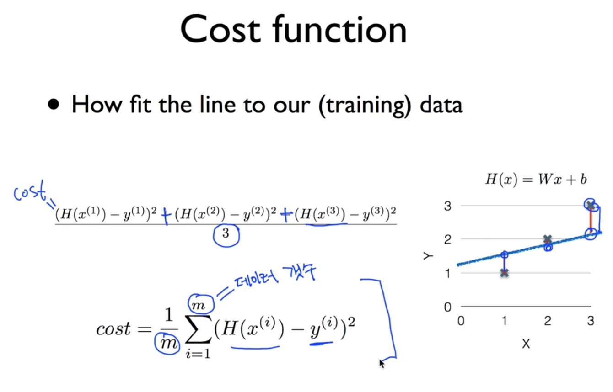
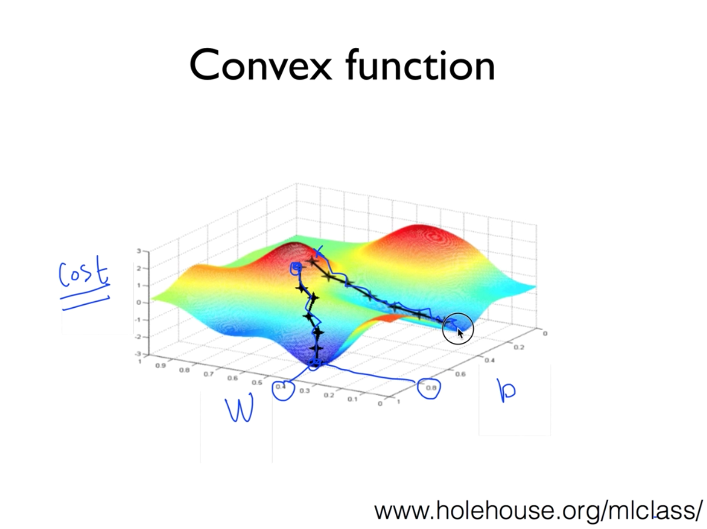
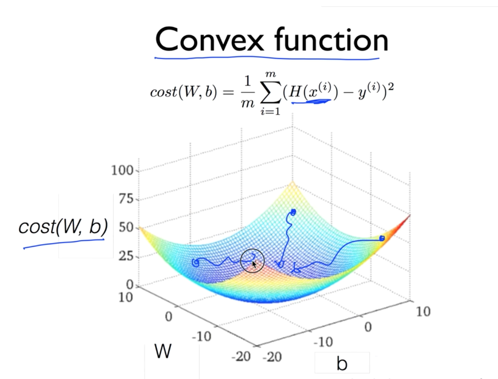
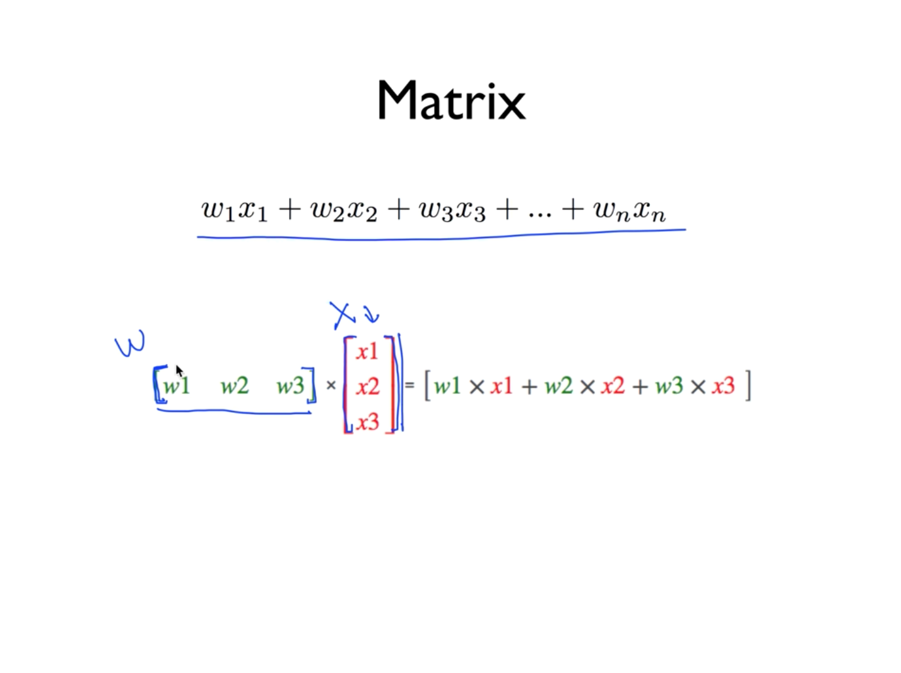

# Linear regression

수학에서의 일반적인 함수를 생각하면 됨.
H(x) = W(x)+b 값들을 예측하는 모델.

다양한 선이 있는데 그 중 어떤 것이 우리 식에 맞는지를 판단하는 모델.

Cost function ( loss function ) - 실제와 우리 예측이 얼마나 차이가 나는지.
보통 제곱해서 계산함. 양수, 음수 편차가 벌어진 것 보다 양수 값 만으로 편차를 계산하는 것이 합리적.
`(H(x)-y)^2`

H = Hypothesis (가설)



Minimize cost. W, b 의 최소값을 구하는 것이 목표.

## Lab
```
Hypothesis = W * x_data + b
```

모델링을 해서 Hypothesis 값을 구함.
Placeholder 를 사용해서 먼저 구한 Hypothesis 공식에 다른 입력값을 대입.


## Linear regression 최소화

Gradient descent algorithm (경사 하강 알고리즘)
Minimize problems 에 많이 사용됨.

W1, W2, W3 ... 반복하며 찾음.

한 값을 기준으로 계속 전진(하강) 해 가며 최소값을 찾는 알고리즘.
미분값(기울기) 를 기준으로 스텝 다운 하면서 미분값이 0 이 되는 지점을 찾기.

이런 경우는 최소값이 안 나올수 있음.



반드시 Cost function 모양이 convex function 이 되도록 설명해야 함.




## Multi-variable linear regression

X 값이 여러개.
`H(x1,x2) = W1,x1 + W2,x2 + b`

Matrix



Transpose : 행렬을 다른 마크로 대치.

