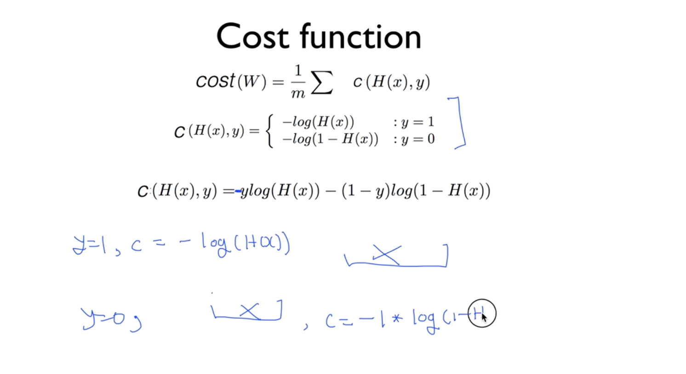

# Logistic (Binary) classification (regression)

True / False

email : spam / ham
facebook : show / hide - 좋아하는 것만 타임라인에 보임
Credit card : 좋아하던 패턴이 아니면 가짜다 라고 판별.

0 / 1 encoding.

주식을 살까? 팔까?

아무리 커도 1 보다는 작도록 코스트 함수 설정.

sigmoid || logistic 함수 - 아무리 커져도 1보다 작고, 아무리 작아도 0보다 큰 함수.

Y hat - 실제 데이터를 예측한 머신러닝 결과

## multinominal

여러개의 binary classification 을 가지고 A || B, A || C, B || C 등의 값을 확인

## softmax 함수

## cross-entropy

⎡1⎤  ⎡0 ⎤   ⎡0⎤ 
⎣0⎦ x⎣∞⎦ = ⎣0⎦ = 0 이면 참에 가까움

⎡1⎤  ⎡∞⎤   ⎡∞⎤ 
⎣0⎦ x⎣0 ⎦ = ⎣0 ⎦ = ∞ 이면 거짓에 가까움.

