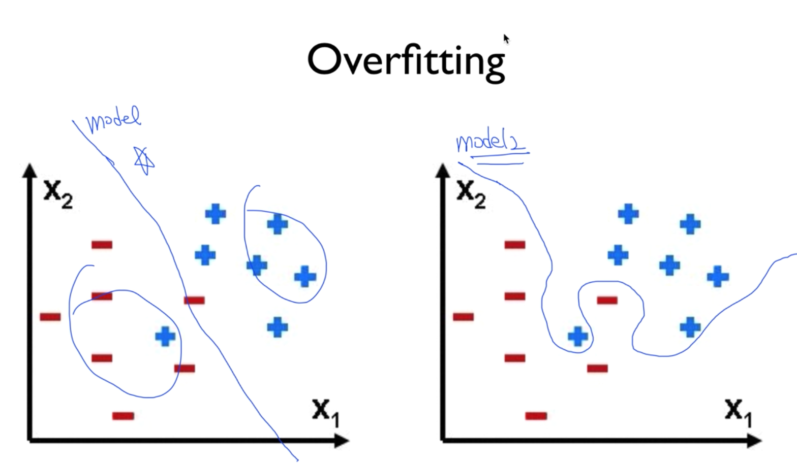

## Learning Rate

Learning overshooting
learning rate 가 너무 큰 경우 함수의 밥그릇 모양 밖으로 튀어나감.
learning rate 가 너무 작은 경우 주기가 끝나도 정확한 값을 못 찾음.

보통 0.01 정도로 시작. 여기서 늘리거나 줄이면서 찾아볼 것.

Cast 함수가 계속 커지는 경우 - normalize 필요.

## Overfitting
학습 데이터에 너무 잘 맞는 모델.
실제 사용시 효용성 떨어짐.

줄이기 위해 가장 좋은 방법 - training set 데이터를 많이 확보.

- Regularization.
  - Weight 를 너무 큰 값을 가지지 말것. (구부리지 말고 펼것.)

## Training Testing dataset

자료가 있으면 70% 정도만 가지고 training set 으로 활용.
학습이 끝난 후 남은 30% 정도의 데이터를 test set 으로 활용 해서 학습을 검증.

이런 방법으로 학습 결과를 평가할것.

Training / Validation / Test set 으로 3단계로 나누기도 함.

## Online learning

데이터 셋이 매우 많을 때 구간을 나눠서 구간별로 학습한 결과를 모델링에 넣어 놓고 비교 대조.
Prelert 가 이런 모델 쓰는듯.

