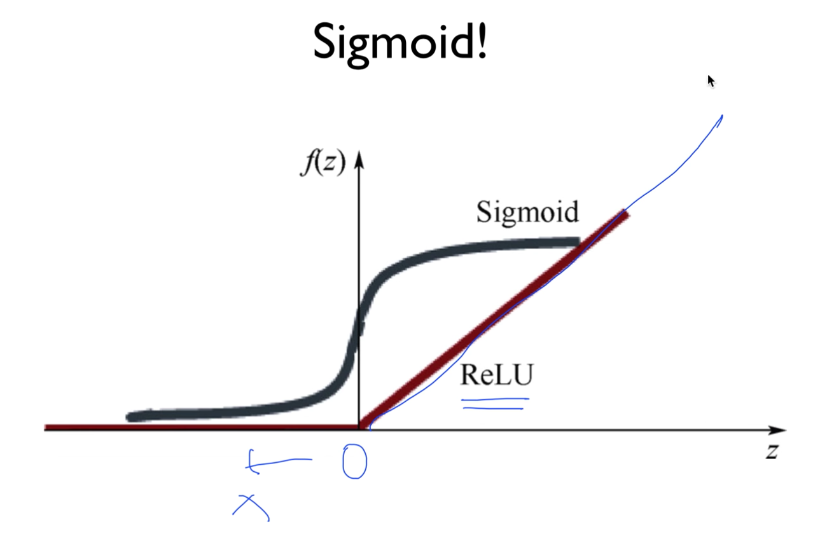

# 딥러닝 잘하기.

## XSigmoid < ReLU

Backpropagation 는 2, 3 단은 학습이 되는데 그 이상은 잘 안됨.
Vanishing gradient - 기울기가 사라짐. 학습이 어렵다.

ReLU : Rectified Linear Unit

마지막은 sigmoid 로 함.

몇개는 일부러 drop out - 이걸로 학습.
앙상블 이라고 함.

