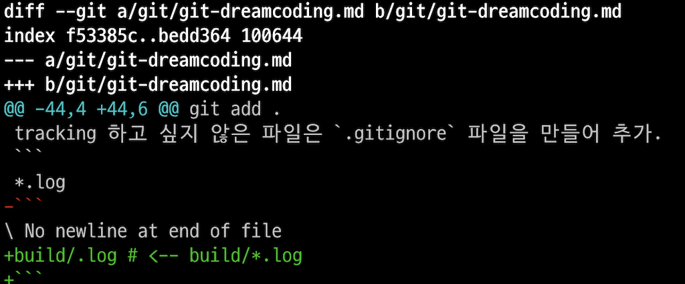

- https://www.youtube.com/watch?v=Z9dvM7qgN9s

글로벌 환경 설정. `--global` 안 하면 현재 폴더 기준으로 생성됨.
```
git config --global
```
에디터로 환경 설정 편집
```
git config --global -e
```
시작 : `git init`
삭제 : `git -rf .git`

단축키 설정 : `git status` 대신 `git st` 로 실행 가능
```
git config --global alias.st status
```

Git 의 상태들
working directory --> staging area --> .git directory ==push==> remote (github)
working directory <==pull== remote

working directory : tracked | untracked
tracked : unmodified | modified

working directory | tracked | modified 만 staging 으로 이동함.

`git status` 를 이용해서 상태 볼 수 있음.


### staging area

staging 에 추가
```
git add 
```
staging 에서 tracked 로 이동 삭제
```
git rm --cached *
```
모든 파일 staging 에 추가하면서 삭제된 파일 제거
```
git add .
```

tracking 하고 싶지 않은 파일은 `.gitignore` 파일을 만들어 추가.
```
*.log
build/.log # <-- build/*.log
```

짧게 보기 : `git st -s`
수정 사항 전부 보기 : `git diff`

나갈때는 `q` 키 누르면 나감.
staging 까지 전부 보기 : `git diff --staged` 또는 `git diff --cached`

에디터 이용하도록 설정 : `git config --global -e` 에서 아래 추가
```
[diff]
	tool = vscode
[difftool "vscode"]
	cmd = code --wait --diff $LOCAL $REMOTE
```
difftool 으로 이용해서 VS Code 에서 비교 : `git difftool` `git difftool --staged`

## .git directory : commit
커밋 명령 : `git commit`
옵션 없으면 템플릿 나와서 title, decscription 작성해야 함.
```
Title 

Descrption
```
